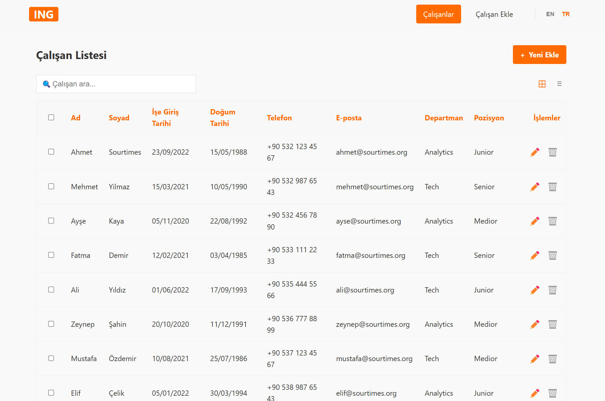

# Employee Management Application

A web application built with LitElement to help HR staff manage employee information efficiently. This application allows users to list, add, edit, and delete employee records with a modern, responsive UI.



## Features

### Employee Records Management

- **List View**: View all employees in either list or table format with pagination and search functionality
- **Create**: Add new employee records with validated form inputs
- **Edit**: Update existing employee information
- **Delete**: Remove employee records with confirmation

### Core Functionality

- **State Management**: Redux integration for predictable state handling
- **Routing**: Client-side routing for seamless navigation
- **Localization**: Support for both English and Turkish languages
- **Responsive Design**: Custom-built responsive layout without external CSS libraries
- **Form Validation**: Comprehensive validation for all employee data fields

## Technical Stack

- **Web Components**: Built with LitElement for efficient, reusable components
- **State Management**: Redux for centralized state
- **Routing**: Custom router implementation
- **Styling**: CSS encapsulation with Shadow DOM
- **Validation**: Custom validation utilities
- **Test**: Coverage ratio exceeds 95% across all components

## Project Structure

```
employee-management-app/
├── src/
│   ├── components/
│   │   ├── common                      # Common components
│   │   ├── app-container.js            # Main application container
│   │   ├── navigation-menu.js          # Navigation component
│   │   ├── employee-list/              # List view components
│   │   └── employee-form/              # Form components for adding/editing
│   ├── redux/
│   │   ├── actions.js                  # Redux actions
│   │   ├── reducers.js                 # Redux reducers
│   │   ├── epics.js                    # Redux epics
│   │   └── store.js                    # Redux store configuration
│   ├── locales/
│   │   ├── en.js                       # English language
│   │   └── tr.js                       # Turkish language
│   ├── utils/
│   │   ├── connect-mixin.js            # Redux connection utility
│   │   ├── localization.js             # Internationalization utility
│   │   └── validation.js               # Form validation helpers
│   ├── test/
│   │   ├── components                  # Test for the components
│   │   ├── redux                       # Test for the redux utility
│   │   └── utils                       # Test for the utils
│   ├── routes.js                       # Application routing
│   └── index.js                        # Application entry point
├── index.html                          # HTML entry point
└── README.md                           # Project documentation
```

## Getting Started

### Prerequisites

- Node.js (v14 or higher)
- npm or yarn

### Installation

1. Clone the repository

   ```
   git clone https://github.com/your-username/employee-management-app.git
   cd employee-management-app
   ```

2. Install dependencies

   ```
   npm install
   ```

3. Start the development server

   ```
   npm start
   ```

4. Open your browser and navigate to `http://localhost:8000`

## Development Notes

### Adding a New Employee

The application validates that:

- All required fields are completed
- Email addresses are in the correct format and unique
- Phone numbers follow the expected pattern
- Dates are properly formatted (DD/MM/YYYY)

### Editing an Employee

- Form is pre-populated with existing employee data
- Same validation rules apply as when creating
- User confirmation is required before saving changes

### Deleting an Employee

- Confirmation dialog appears before deletion
- List view is automatically refreshed after deletion

## Testing

- Run tests with `npm test`
- Coverage ratio exceeds 95% across all components

## Browser Support

- Chrome (latest)
- Firefox (latest)
- Safari (latest)
- Edge (latest)
